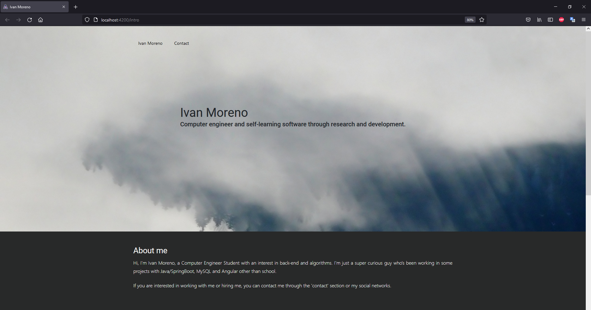
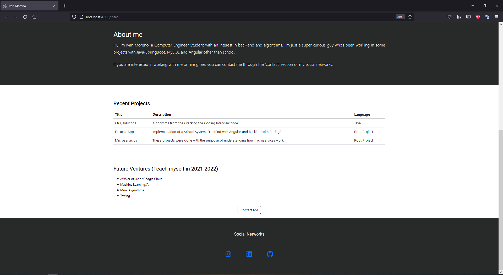
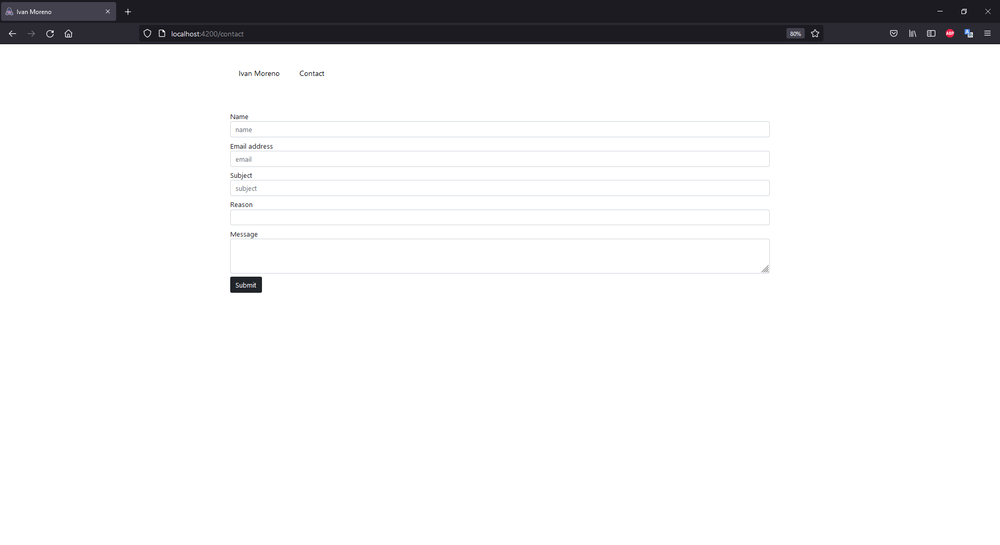

# Ivan Moreno website

## _I used these tools to build my website_
- The Front-end is build with Angular.
- The Back-end is build with spring boot.
- Google SMTP
- GitHub API

##  This is how the site looks

## Tech
Ivan Moreno website uses these repositories to work properly:
 
| REPOS | LINK |
| ------ | ------ |
| Angular | https://github.com/IvanCruzMoreno/mywebsite-frontend |
| SpringBoot | https://github.com/IvanCruzMoreno/mywebsite-backend |

_Note:_ 
- _This website was located on Firebase and Heroku with a free trial, but it expired._
